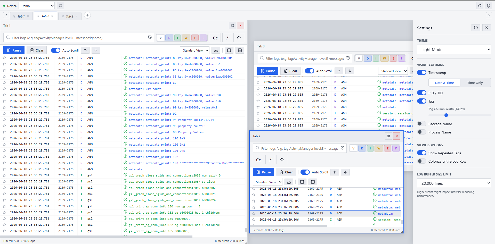

# Android WS Logcat View


A tool to view logcat in your browser powered by Go and NextJS

[](./LICENSE)

# Features
- Stream your logcat live to the internet in real time.
- The interface is visually appealing and has a dark theme suitable for developers.
- Supports multi-window functionality, allowing you to open more tabs and split tabs intelligently.
- Supports autocomplete for full filters.
- No additional installation required, just download and run directly.

## License

```txt
Copyright (C) 2026 Yukohanie

This program is free software: you can redistribute it and/or modify
it under the terms of the GNU General Public License as published by
the Free Software Foundation, either version 3 of the License, or
(at your option) any later version.

This program is distributed in the hope that it will be useful,
but WITHOUT ANY WARRANTY; without even the implied warranty of
MERCHANTABILITY or FITNESS FOR A PARTICULAR PURPOSE.  See the
GNU General Public License for more details.

You should have received a copy of the GNU General Public License
along with this program.  If not, see <https://www.gnu.org/licenses/>.
```
